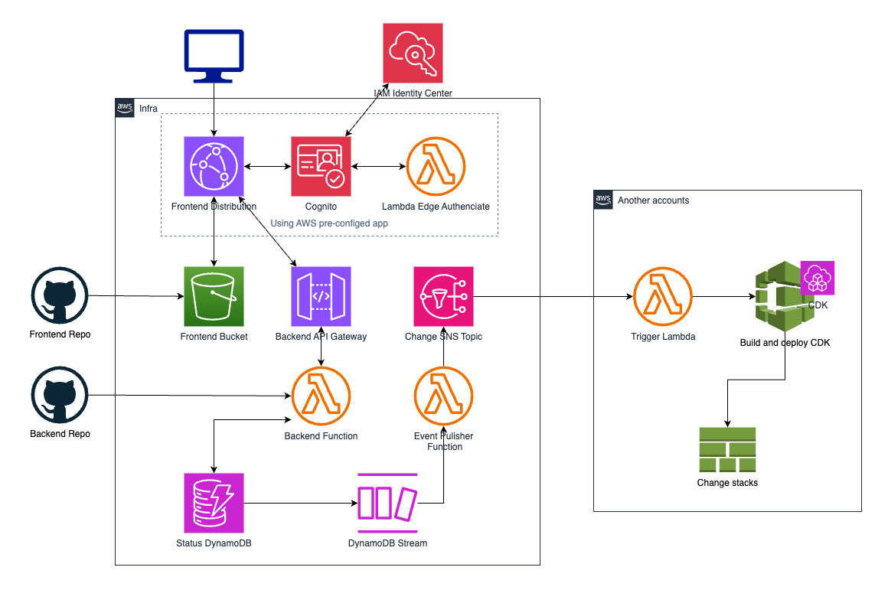
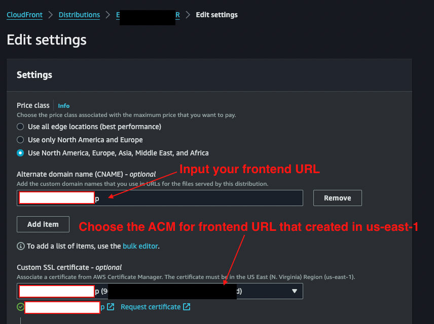
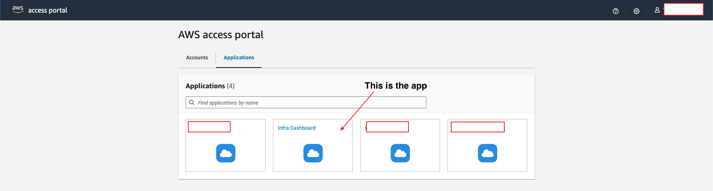
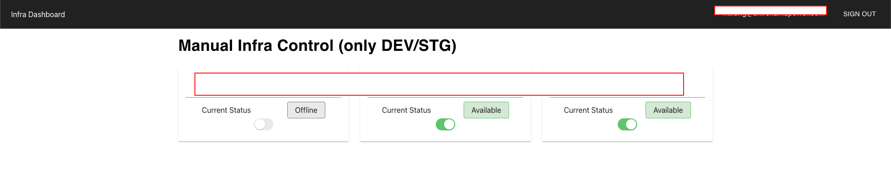

# Building an application in IAM Identity Center

## Introduction
### Background
Being working with AWS for so long, its [pillars of well-architect](https://aws.amazon.com/blogs/apn/the-6-pillars-of-the-aws-well-architected-framework/) imprinted into my brain. 

One of it is cost optimization. 

Even though I have automation to turn on/off for our services outside business hours. 
Some of our project is going to maintenance phase. Features need to be tested in development and staging environments are not as many anymore. 

Our systems have too much un-use time.

If only we have a button that can turn on/off infrastructure whenever we like.

If only we have a function so that even developer can turn on/off system periodically whenever they like..

### IAM Identity Center
<h4> Introducing IAM Identity Center (IAM-IC)! </h4>

Beside being a place to centralize accesses to many of your AWS Accounts. IAM-IC also provide metadata so our application can have it as the identity provider. 

Let's leverage that and also make sure that only IAM-IC authenticated users can access our app.

## System Implementation
### Design

There will be 2 major parts. One is our application backend and frontend reside in a centralized AWS account. 

Other will be process to turn on/off resources in registered satellite accounts. Which will be different for each, could be lambda function calling AWS API to turn on/off function. Or in my case, since I created our resources with CDK, I can easily setup a pipeline that boots up a Codebuild Instance and running infra change command. (1)
{ .annotate }

1.  And if setting up turn on/off process is the same for every satellite accounts. You can create Service Catalog, share with the whole Organization for simplicity.

With our system in centralize AWS account. Of course my lazy ass will try to avoid backend code as much as possible. So I will be using [AWS Pre-config Authentication App](https://console.aws.amazon.com/lambda/home?region=us-east-1#/create/app?applicationId=arn:aws:serverlessrepo:us-east-1:520945424137:applications/cloudfront-authorization-at-edge).

The Pre-config app will create cloudfront distribution, user pool and lambda function that handles authentication process for us. (1) In addition, we will also need to create additional components to handle various of our app. I explain each component and its purpose below. But I won't go into detail how to set it up.
{ .annotate } 

1. Change to your prefer region before creating the app. Default is us-east-1.

<h4> Additional components for our system: </h4>
`IAM-IC`
:   Our IDP which stores all users' information. Also being that starting point to access our application. I'm using our pre-existing IAM-IC so it's required a little bit of manual config.

`Frontend bucket`
:   Serve React's SPA statically. Authenticate access with Cognito user pool created by AWS Pre-config app.

`Backend API Gateway`
:   API front for our backend function, user must authenticated with Cognito user pool created by AWS Pre-config app.

`Backend Function`
:   Handle request accordingly. For now I only have 2 functions, read all infra status and change status to on/off of a specify infra environment.

`Status DynamoDB`
:   Database to store status of all infra environments.

`DynamoDB stream`
:   Streaming whenever there is a change in one of our records. Trigger data processing lambda function.

`Event Publisher Function`
:   Receive data from dynamoDB stream and publish a SNS topic with attribute

`Change SNS Topic`
:   Send message to all subscribers in all accounts. Each subscription will have a filtering to check if the message destined to its account then process with appropriate action..

### Implement
#### 1. Setting AWS Pre-config App
The purpose of AWS Pre-config App is to handle authentication for any content hosting through Cloudfront.

In our case, we want to serve a SPA app in S3 bucket. So there will be a few parameter we need to change when creating the app.

<h5>Parameters in AWS Pre-config App:</h5>

| Parameter        | Value                          | Note|
| :----------   | :----------------------------------- |:----|
| `HttpHeaders` | add backend URL to connect-src part of Content-Security-Policy| This is require if URL of your backend and frontend is different. If not set, you will encounter error when calling backend|
| `OriginAccessIdentity`|  OAI ID  | Create OAI first then include its ID here |
| `S3OriginDomainName`| S3 that contain SPA app | S3 origin domain will be in format:<br> **bucket-name**.s3.**region**.amazonaws.com |
| `RedirectPathSignOut`| A page to redirect user when signed out | I set it to /signedout |
| `SignOutUrl`| Url that when request, it will sign user out | I set it to /signout |

#### 2. Other components setup
Creating other components, we can use [CDK](https://docs.aws.amazon.com/cdk/v2/guide/getting_started.html) and I highly recommend doing it that way.
But because CDK haven't support changing attribute of imported distribution yet. We need to map a certificate in ACM to Cloudfront Distribution using AWS Console.


We also need make sure Cognito is our Authorizer for API Gateway (this time using CDK):
``` typescript
// Import User pool create by AWS Pre-config App
const userPool = cognito.UserPool.fromUserPoolArn(this, "pre-created-userpool", "arn:aws:cognito-idp:region:accountID:userpool/region_cognitoID");

// Register our Authorizer
const auth = new apigw.CognitoUserPoolsAuthorizer(this, 'cognito-authorizer', {
    cognitoUserPools: [userPool],
    authorizerName: "CognitoAuthorizer"
});

// Require Authorizer in necessary method
declare const backendApi: apigateway.LambdaRestApi;
declare const lambdaIntegrate: apigateway.LambdaIntegration;
const items = backendApi.root.addResource('path'); //your custom path

items.addMethod(
    'GET',
    lambdaIntegrate,
    {
        authorizationType: apigateway.AuthorizationType.COGNITO,
        authorizer: auth
    }
);
```

#### 3. Create IAM-IC custom app
Now we need to tell Cognito to use IAM-IC as Identity provider and mapping attribute to custom app.

A little bit complicate here so I will make step by step explanation (make sure to have 2 tabs open, 1 for IAM-IC and 1 for Cognito User pool)

1. In IAM-IC tab, click to Applications in left side panel. Then Add application.
    * Choose I have an application I want to set up, Application type is SAML 2.0. Hit next.
    * Put Display name and Description. Do **NOT** hit submit.
    * Copy IAM Identity Center SAML metadata file URL.
2. In Cognito, open Sign-in experience tab. 
    * In Federated identity provider sign-in, click Add identity provider.
    * Choose SAML.
    * Provide a name for identity provider. Ex: IAMICProvider.
    * In Metadata document source, choose Enter metadata document endpoint URL and paste SAML metadata file URL in step 1 here.
    * Click Add identity provider.
3. Move to App Integration tab.
    * Scroll down to App clients and analytics and click to the app that created in there (Name format: UserPoolClient-*random string*).
    * Scroll to Hosted UI, click Edit.
    * Not sure what was the default value, so I will list everything here. Change to following value:

    | Parameter        | Value                          | 
    | :----------   | :----------------------------------- |
    | `Allowed callback URLs` | *https://your-frontend-url.com*/parseauth |
    | `Allowed sign-out URLs`|   *https://your-frontend-url.com*/signout  |
    | `Identity providers`| Identity provider created in step 2. Ex: IAMICProvider | 
    | `OAuth 2.0 grant types`| Authorization code grant |
    | `OpenID Connect scopes`| Select everything |

4. Go back to user pool and in App integration tab.
    * Copy Cognito domain
    * Append **/saml2/idpresponse** to the domain URL. The result will be something like:<br>
    ==https://*cognito-custom-hash*.auth.*region*.amazoncognito.com**/saml2/idpresponse**==
    * Go to IAM-IC tab and paste above value to Application ACS URL
5. Go back to Cognito tab, copy User pool ID (something like **region_abcdEFGH**)
    * Append urn:amazon:cognito:sp: before User pool ID so we have a string like: <br>
    ==urn:amazon:cognito:sp:**region_abcdEFGH**==
    * Paste it to Application SAML audience in IAC-IC tab.
6. I promise this will be the last settings :sweat_smile:
    * Go back to IAC-IC tab.
    * Enter your [https://your-frontend-url.com](https://your-frontend-url.com) to Application start URL.
    * Submit the app.
    * After submit the app, go to its detail setting.
    * Click Actions -> Edit attribute mappings.

    | Parameter        | Value                          | 
    | :----------   | :----------------------------------- |
    | `Maps to this string value or user attribute in IAM Identity Center` | ${user:email} |
    | `Format`|   emailAddress  |

    * Save. And we're done! :confetti_ball:

## Result
Now we have our own application and able to access it from AWS Portal!!!


Clinking it will open new tab to access our application. We can also access our application directly if enter [https://your-frontend-url.com](https://your-frontend-url.com) in our browser. But it will redirect to AWS portal and require user to login before continue.


### Running cost
- Using serverless, plus my system will not have too many requests daily. My estimate is about 5 per day (150 monthly).
You can say our system is basically free.
- Using Cognito with SAML will be free as long as you keep the number of users below 50.
- You do have to pay for route53 host zone. $0.50 per month. 
- Codebuild (in satellite accounts) On-demand might be the most expensive thing ($0.00425 per min). Assuming every time CodeBuild run, it will take 5 minutes. Monthly total will be $0.00425 * 5 * 150 = $3.1875
- **Total cost**: $0.50 + $3.1875 = $3.6875 (monthly)

## Summary
By leveraging serverless technology, we can have a system that help us control infrastructure easier. Not only so, the system also secure and only accessible within AWS Organization.

The estimated monthly cost is kept under $4, and with hundreds of dollars saved from turning off Development and Staging environment. I'm sure the system is extremely cost-effective, align perfectly with AWS pillar of well-architect.