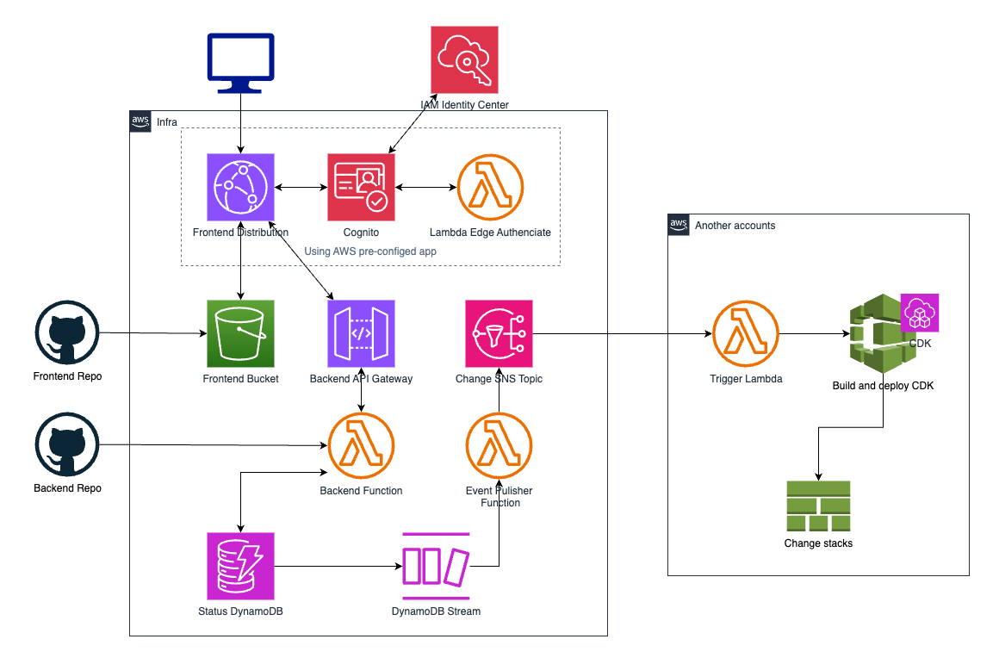
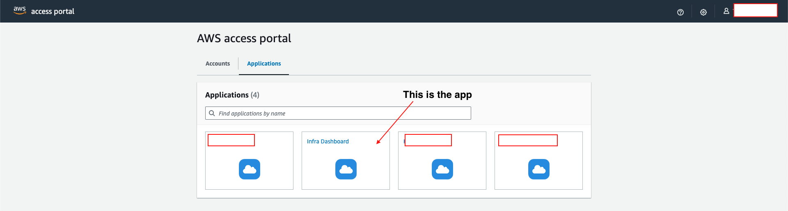
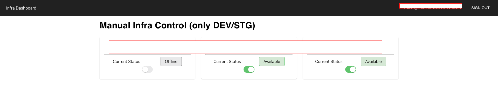

---
tags:
  - AWS
  - Serverless
  - Cognito
---

# Building an application in IAM Identity Center

!!! note "All written in code now !"
    Update 2025/11/11, we can integrate AWS Pre-config app in our own CDK so you don't have to manual setting anything in AWS.

    Go to **https://github.com/pitayapj/serverless-private-site** for more detail 

## Introduction
### Background
Working with AWS for so long, I think its [pillars of well-architect](https://aws.amazon.com/blogs/apn/the-6-pillars-of-the-aws-well-architected-framework/) imprinted into my brain. 

I always find a way to optimizing the cloud resources and one of the optimization aspect will be cost.

Even though I have introduced an automation to turn on/off for our services outside business hours (of course only for Development and Staging environment). 
Some of our projects are going in to maintenance phase, features and new functions need tested are not as many as before.

Our systems have too much un-use time. So, naturally I want a system that can turn on our infrastructure when we need.
And turn it off otherwise.

Of course we need to make sure that access to the system is secure, only accessible internally.
### IAM Identity Center
<h4> Introducing IAM Identity Center (IAM-IC)! </h4>

Beside being a centralize access place to many of your AWS Accounts. IAM-IC also provide metadata so applications can have it as the identity provider. 

Let's leverage that and also make sure that only IAM-IC authenticated users can access our app.

## System Implementation
### Design

There will be 2 major parts. One is our application backend and frontend reside in a centralized AWS account. 

Other will be process to turn on/off resources in registered satellite accounts. Which will be different for each, it could be a lambda function calling AWS API to turn on/off resources. Or in my case, since I created our resources with CDK, my process compose of a lambda function, a pipeline that will be trigger by that lambda function and spin up a Codebuild Instance and run command base on input receive from centralized account.

The system will only have 2 extremely simple functions, list all infrastructures along with its status and changing status of one specific infrastructure environment. 

So I will be using [AWS Pre-config Authentication App](https://console.aws.amazon.com/lambda/home?region=us-east-1#/create/app?applicationId=arn:aws:serverlessrepo:us-east-1:520945424137:applications/cloudfront-authorization-at-edge) to do the authentication process.

The Pre-config app will only create lambda functions that handles authentication process for us. We need to create our own Cloudfront and Cognito User pool

<h4> Additional components for our system: </h4>
`IAM-IC`
:   Our IDP which stores all users' information. Also being that starting point to access our application. I'm using our pre-existing IAM-IC so it's required a little bit of manual config.

`Frontend bucket`
:   Serve React's SPA statically. Authenticate access with Cognito user pool created by AWS Pre-config app.

`Backend API Gateway`
:   API front for our backend function, user must authenticated with Cognito user pool created by AWS Pre-config app.

`Backend Function`
:   Handle request accordingly. For now I only have 2 functions, read all infra status and change status to on/off of a specify infra environment.

`Status DynamoDB`
:   Database to store status of all infra environments.

`DynamoDB stream`
:   Streaming whenever there is a change in one of our records. Trigger data processing lambda function.

`Event Publisher Function`
:   Receive data from dynamoDB stream and publish a SNS topic with attribute

`Change SNS Topic`
:   Send message to all subscribers in all accounts. Each subscription will have a filtering to check if the message destined to its account then process with appropriate action..

`Cognito User Pool`
:   Just user pool

`Cloudfront CDN`
:   Handle traffic, also be the landing for our authentication process Lambda Edge

### Implement
#### Create IAM-IC custom app
Now we need to tell Cognito to use IAM-IC as Identity provider and mapping attribute to custom app.

A little bit complicate here so I will note down step by step action (make sure to have 2 tabs open, 1 for IAM-IC and 1 for Cognito User pool)

1. In IAM-IC tab, click to Applications in left side panel. Then Add application.
    * Choose I have an application I want to set up, Application type is SAML 2.0. Hit next.
    * Put Display name and Description. Do **NOT** hit submit.
    * Copy IAM Identity Center SAML metadata file URL.

2. Prepare other necessary parameter to deploy CDK app (reference　.env.example)
    You need a repository in github for cdk app and established Github and Codestar connection
    
    Along with choosing region and AWS account to deploy, edit said repo name and connection arn in .env file
    
    Choose which environment to deploy or not deploy by commenting lib/stacks/cdk-pipeline.ts line 106-115

    Deploy CDK app with 
    ```sh
    cdk deploy CDKPipelineStack --profile pitaya
    ```

3. Retrieve information from Cognito and paste to IAM-IC app
    * Enter your [https://your-frontend-url.com](https://your-frontend-url.com) to Application start URL.

    * Append `urn:amazon:cognito:sp:` before User pool ID so we have a string like: <br>
    ==urn:amazon:cognito:sp:**region_abcdEFGH**==
    * Paste it to Application SAML audience in IAC-IC tab.

    * Append `/saml2/idpresponse` to last part of Cognito DomainUrl so we will have something like this <br>
    https://&lt;customize-sub-domain&gt;.auth.region.amazoncognito.com/saml2/idpresponse

    * Paste it to ACS URL in IAC-IC tab.

    * Click create app

4. Mapping attributes
    * Go to its detail setting.
    * Click Actions -> Edit attribute mappings.

    | Parameter        | Value                          | 
    | :----------   | :----------------------------------- |
    | `Maps to this string value or user attribute in IAM Identity Center` | ${user:email} |
    | `Format`|   emailAddress  |

    * Save. And we're done! :confetti_ball:

## Result
Now we have our own application and able to access it from AWS Portal!!!


Clinking it will open new tab to access our application. We can also access our application directly if enter [https://your-frontend-url.com](https://your-frontend-url.com) in our browser. If not logged in, it will redirect to AWS portal and require user to login before continue.


### Running cost
- Using serverless, plus my system will not have too many requests daily. My estimate is about 5 per day (150 monthly).
You can say our system is basically free.
- Using Cognito with SAML will be free as long as you keep the number of users below 50.
- You do have to pay for Route53 host zone for backend and frontend URL. $0.50 per month. 
- Codebuild (in satellite accounts) On-demand might be the most expensive thing ($0.00425 per min). Assuming every time CodeBuild run, it will take 5 minutes. Monthly total will be $0.00425 * 5(min) * 5(times per day) * 30(days) = $3.1875
- **Total cost**: $0.50 + $3.1875 = $3.6875 (monthly)

## Summary
Connecting Identities is not my strong point in any mean. But having Cognito (with little help from pre-config app from AWS) makes it so much easier. I'm using IAC-IC as my identity provider but I'm sure setting it up with other IDPs (Google Workspace, Microsoft AD, ..) is the same.

The estimated monthly cost is kept under $4, and with hundreds of dollars saved from turning off Development and Staging environment. I'm sure the system is extremely cost-effective, align perfectly with AWS pillar of well-architect.